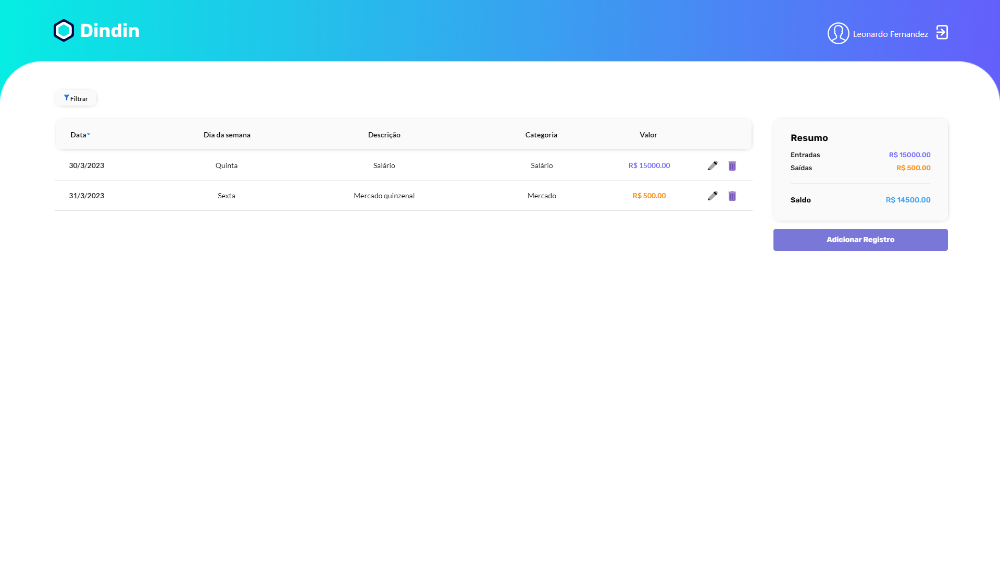

<h1 align="center"> Dindin </h1>

Aplicativo de registro e controle de finanças pessoais.

  <a href="#-tecnologias">Tecnologias</a>&nbsp;&nbsp;&nbsp;|&nbsp;&nbsp;&nbsp;
  <a href="#-projeto">Projeto</a>&nbsp;&nbsp;&nbsp;|&nbsp;&nbsp;&nbsp;
  <a href="#-layout">Layout</a>&nbsp;&nbsp;&nbsp;

 

  

## 🚀 Tecnologias

Esse projeto foi desenvolvido com as seguintes tecnologias:

- ReactJS
- HTML e CSS
- JavaScript
- Git e Github

## 💻 Projeto

O sistema trata-se de uma aplicação para controle de finanças pessoais. Nesta aplicação consta as seguintes funcionalidades são:

- Cadastro do usuário
- Login de usuário
- Cadastro de uma nova transação
- Edição de uma transação
- Exclusão de uma transação
- Listagem de transações
- Permitir ordenar a tabela por data
- Na parte de resumo, o valor de entradas, saídas e saldo é obtido por meio do endpoint de extrato da **API**
- Permitir o usuário filtrar a tabela por categoria
- Editar perfil de usuário
- Deslogar usuário

## 🔖 Layout

Você pode visualizar o layout do projeto através [DESSE LINK](https://www.figma.com/file/BwOAJkF8OeMON36TyFdhkj/DinDin-2.0?node-id=0%3A1). É necessário ter conta no [Figma](https://figma.com) para acessá-lo.
